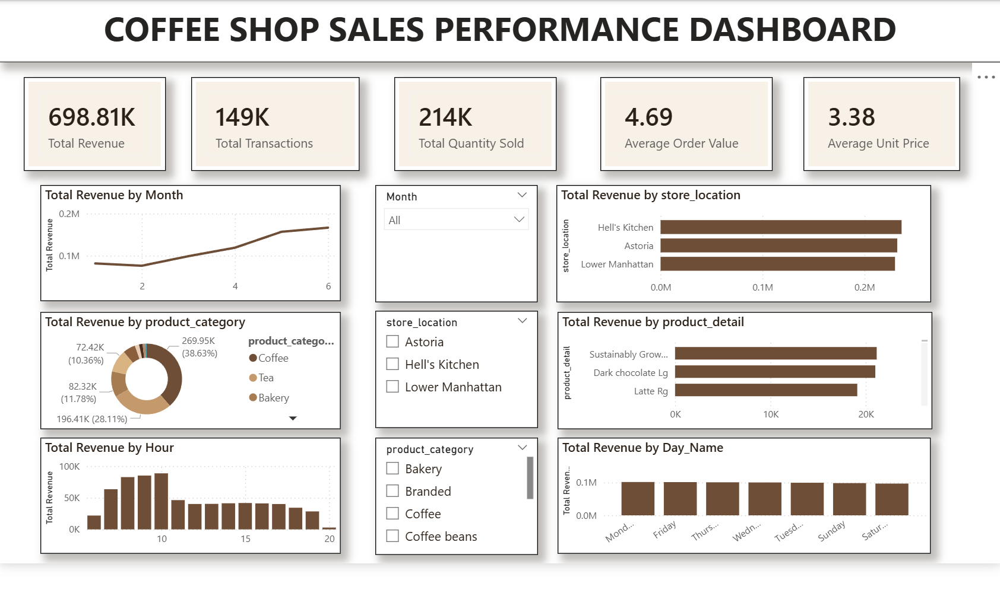

# Coffee Shop Sales Analysis

## Project Overview
This project analyzes coffee shop transaction data to identify sales trends, store performance, product performance, and peak sales periods.

The project uses **Excel**, **MySQL**, and **Power BI** to clean, analyze, and visualize 149,116 coffee shop transaction records from January 2023 to June 2023.

## Tools Used
- **Excel**: Data cleaning, calculated columns, and data preparation
- **MySQL**: Data import, SQL queries, and business analysis
- **Power BI**: Interactive dashboard and data visualization

## Dataset
The dataset contains coffee shop transaction data with the following key fields:

- `transaction_id`
- `transaction_date`
- `transaction_time`
- `transaction_qty`
- `store_location`
- `product_category`
- `product_type`
- `product_detail`
- `unit_price`
- `Revenue`
- `Month`
- `Day_Name`
- `Hour`

## Business Questions
This project answers the following questions:

1. What is the total revenue?
2. How many transactions were recorded?
3. Which month generated the highest revenue?
4. Which store location performed best?
5. Which product categories generated the most revenue?
6. What are the top products by revenue?
7. Which hours have the highest sales?
8. Which days of the week perform best?

## Key Metrics
- Total Revenue
- Total Transactions
- Total Quantity Sold
- Average Order Value
- Revenue by Month
- Revenue by Store Location
- Revenue by Product Category
- Top 10 Products by Revenue
- Revenue by Hour
- Revenue by Day of Week

## Dashboard
The Power BI dashboard includes:

- KPI cards for revenue, transactions, quantity sold, and average order value
- Monthly revenue trend
- Revenue by store location
- Revenue by product category
- Top 10 products by revenue
- Revenue by hour
- Revenue by day of week
- Interactive slicers for month, store location, and product category

> Add your dashboard screenshot here after exporting it from Power BI:
>
> `

## Key Insights
- Total revenue reached approximately **$698.8K** from **149,116 transactions**.
- Sales performance varied by month, store location, product category, day of week, and hour.
- Time-based analysis helps identify peak sales hours for staffing and inventory planning.
- Product category analysis supports promotion and stock planning decisions.
- Store-level comparison helps identify high-performing locations.

## Project Files
| File | Description |
|---|---|
| `Coffee_Shop_Sales_MySQL_Ready.xlsx` | Cleaned Excel dataset |
| `Coffee_Shop_SQL_Results.xlsx` | SQL analysis results exported to Excel |
| `Coffee shop.pbix` | Power BI dashboard file |
| `coffee_shop_mysql_setup.sql` | SQL script to create database and table |
| `sql_queries.sql` | SQL queries used for analysis |
| `Coffee_Shop_PowerBI_Theme.json` | Power BI dashboard theme |

## How to Use
1. Open `Coffee_Shop_Sales_MySQL_Ready.xlsx` to review the cleaned dataset.
2. Run `coffee_shop_mysql_setup.sql` in MySQL Workbench to create the database and table.
3. Import the cleaned CSV file into MySQL.
4. Run `sql_queries.sql` to generate analysis results.
5. Open `Coffee shop.pbix` in Power BI Desktop to view the dashboard.

## Author
Pham Quang Minh
